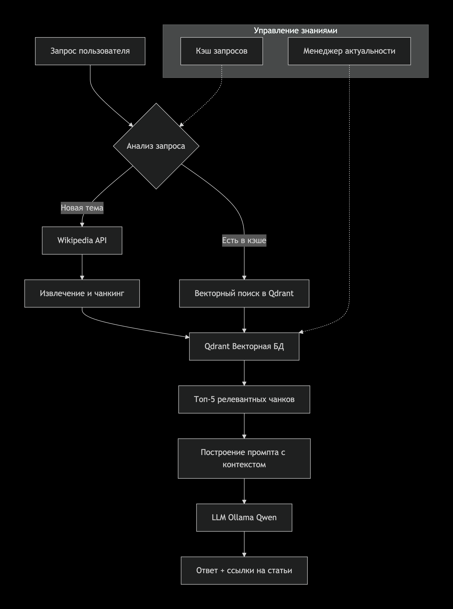

## **RAG-система с динамическим пополнением знаний из Wikipedia API**

**Кодовое название:** `WikiRAG`

**Цель:** Создать систему, которая может:
1. Получать актуальную информацию по запросу пользователя из Wikipedia
2. Индексировать её в векторной БД
3. Давать точные ответы с ссылками на конкретные статьи
4. Иметь историю запросов и собранных знаний

---

### **1. Проблематика и ценность**
---

### **2. Архитектура приложения**



---

### **3. Новые функциональные требования**

#### **Модуль работы с Wikipedia API**
*   **Цель:** Динамическое получение и обновление информации.
*   **Требования:**
    1.  **Поиск статей:** Использовать `wikipedia-api` (Python library) или прямой REST API Wikipedia для поиска по ключевым словам.
    2.  **Извлечение контента:** Загружать полный текст статьи, очищать от разметки.
    3.  **Метаданные:** Сохранять для каждой статьи:
        *   `title` (заголовок)
        *   `pageid`
        *   `url` (прямая ссылка)
        *   `summary` (краткое описание)
        *   `last_edited` (дата последнего редактирования)
        *   `categories` (категории статьи)
    4.  **Ограничения:** Настраиваемый лимит статей на запрос (например, первые 5 релевантных).

#### **Стратегия обновления знаний**
*   **Приоритет свежести:** При запросе темы, которая уже есть в базе:
    1.  Проверять дату последнего обновления статьи в Wikipedia
    2.  Если статья обновлялась более N дней назад (например, 30) — обновлять данные
*   **Дедупликация:** Не создавать дубликаты при повторных запросах на одну тему
*   **Семантическое связывание:** При запросе "Илон Маск" также искать связанные статьи ("Tesla", "SpaceX", "Neuralink")

#### **Система кэширования запросов**
*   **Простой кэш:** Хранить историю запросов и использованных статей в SQLite
*   **Структура таблицы:**
    ```sql
    queries (
        id INTEGER PRIMARY KEY,
        query_text TEXT,
        timestamp DATETIME,
        articles_used JSON  -- список pageid
    )
    
    articles (
        pageid INTEGER PRIMARY KEY,
        title TEXT,
        last_fetched DATETIME,
        last_edited DATETIME,
        vectorized BOOLEAN  -- флаг, что статья уже в Qdrant
    )
    ```

---

### **4. Улучшенный процесс генерации ответов**

**Шаблон промпта с учетом источников:**
```
Ты — эксперт по Wikipedia, отвечающий на вопросы пользователей.

ИСПОЛЬЗУЙ ТОЛЬКО информацию из предоставленного контекста.
Если в контексте нет ответа — скажи "Этой информации нет в Wikipedia".

Контекст из статей Wikipedia:
---
[Статья 1: {название_статьи_1}]
{текст_чанка_1}
---
[Статья 2: {название_статьи_2}]
{текст_чанка_2}
---

Вопрос: {вопрос_пользователя}

Ответ (обязательно укажи в квадратных скобках номера статей, на которые опираешься, например [1][3]):
```

**Формат ответа должен включать:**
1.  Текстовый ответ
2.  Цифровые ссылки на статьи [1][2]
3.  В конце — список использованных статей с гиперссылками

---

### **5. Возможные сценарии использования**

1.  **Исследовательский запрос:** "Расскажи про последние открытия в квантовых вычислениях"
    *   Система ищет свежие статьи по теме
    *   Индексирует их в Qdrant
    *   Формирует консолидированный ответ

2.  **Сравнительный анализ:** "Чем отличаются подходы к ИИ у OpenAI и DeepMind?"
    *   Система загружает статьи про обе компании
    *   Находит пересекающиеся темы
    *   Формирует сравнительную таблицу

3.  **Факт-чекинг:** "Когда была основана компания Nvidia и чем она занимается?"
    *   Проверка точности информации
    *   Ссылки на конкретные факты

---

### **6. Расширенные метрики для оценки**

Помимо стандартных метрик RAG, добавьте:

1.  **Свежесть данных (Data Freshness Score):**
    *   Средний возраст используемых статей
    *   Доля статей, обновленных за последний месяц

2.  **Покрытие темы (Topic Coverage):**
    *   Количество уникальных статей, использованных для темы
    *   Глубина вложенности (на сколько "кликов" от основной статьи уходит система)

3.  **Эффективность кэша:**
    *   Hit Rate локального кэша
    *   Время ответа с кэшем vs без кэша

---

### **7. Дорожная карта развития с Wikipedia**

**Фаза 1: Базовый прототип**
- [ ] Простая интеграция Wikipedia API
- [ ] Сохранение статей в Qdrant
- [ ] Базовая генерация ответов

**Фаза 2: Умное управление знаниями**
- [ ] Система обновления устаревших статей
- [ ] Дедупликация и связывание тем
- [ ] SQLite для хранения метаданных

**Фаза 3: Расширение источников**
- [ ] Добавление других API (ArXiv для научных статей, NewsAPI для новостей)
- [ ] Мультиязычная поддержка (разные языковые версии Wikipedia)
- [ ] Приоритизация источников (научные статьи > Wikipedia > новости)

**Фаза 4: Продвинутые фичи**
- [ ] Автоматическое определение, когда информации недостаточно
- [ ] Генерация уточняющих вопросов
- [ ] Визуализация графа связей между статьями

---

---

### **9. Риски и их минимизация**

| Риск | Митигация |
|------|-----------|
| Wikipedia API лимиты | Использовать библиотеку с кэшированием, уважать rate limits |
| Неполные статьи | Комбинировать несколько статей по теме, использовать summary |
| Изменение структуры API | Использовать официальную библиотеку, иметь fallback |
| Вандализм в Wikipedia | Проверять дату редактирования, использовать стабильные версии |

---
